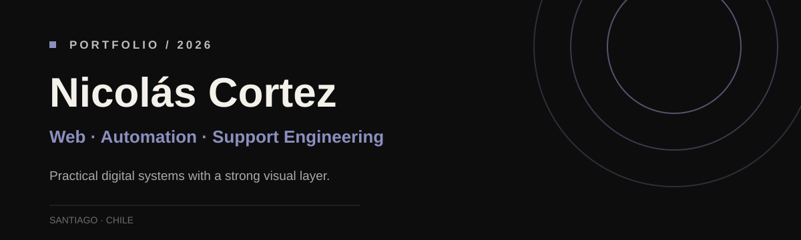
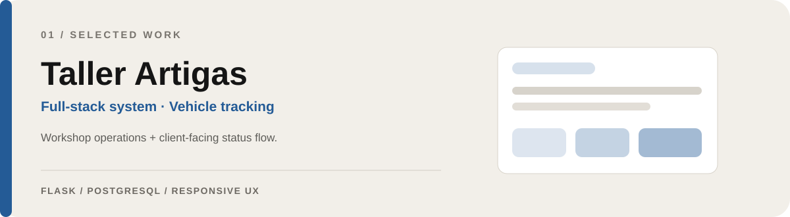
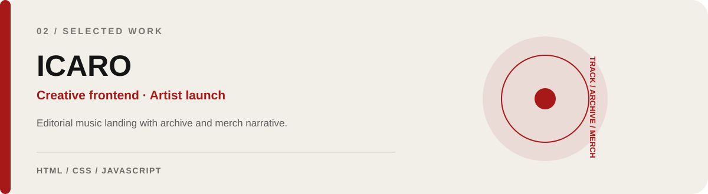
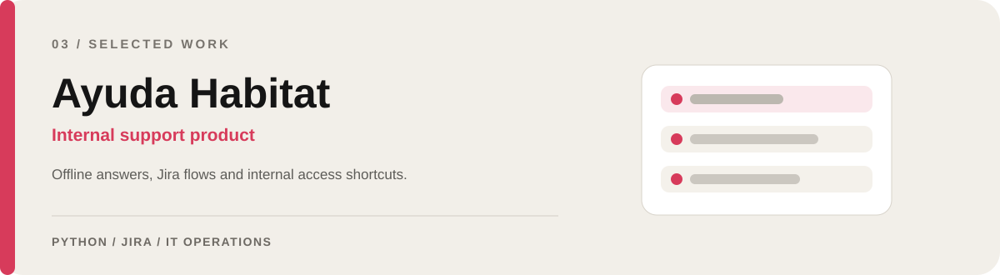
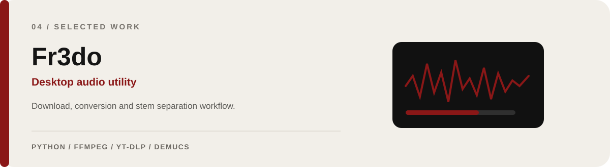
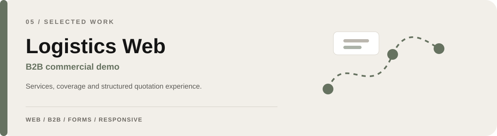
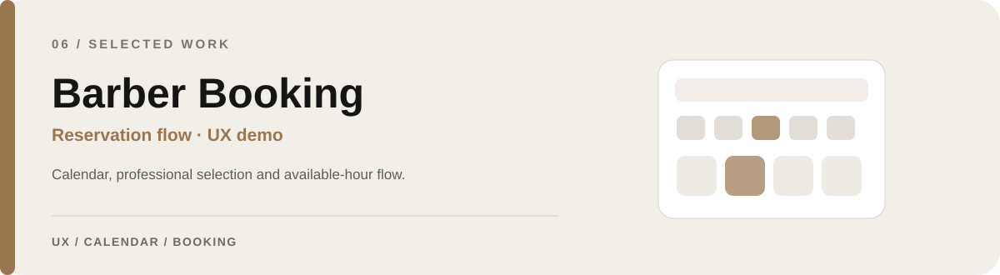

  

  <a href="mailto:ni.cortez@duocuc.cl"><b>Contact</b></a>
  &nbsp;·&nbsp;
  <a href="https://github.com/N0isome"><b>Repositories</b></a>

I design and build digital products that connect **frontend, operational workflows and automation**. My work ranges from full-stack systems and internal support tools to creative web experiences and desktop utilities.

## Selected work

**Taller Artigas** — Web system for workshop operations and public vehicle tracking.  
[Live demo ↗](https://gestion-taller-8qrs.onrender.com/) &nbsp;·&nbsp; [Source ↗](https://github.com/N0isome/Gestion-Taller-)

 

**ICARO** — Editorial frontend concept for a music release, visual archive and conceptual merch.  
[Source ↗](https://github.com/N0isome/Icaro-web)

 

**Ayuda Habitat** — Internal support tool focused on offline answers, Jira flows and access to operational portals.  
_Private/internal implementation._

 

**Fr3do** — Desktop utility for audio extraction, conversion and optional stem separation.  
[Source ↗](https://github.com/N0isome/Fr3do)

 

**Logistics Web** — Commercial concept for transport/logistics companies, focused on services, coverage and quotation requests.  
_Case study / commercial demo._

 

**Barber Booking** — Appointment flow with calendar selection, three professionals and available-hour validation.  
_Functional UX demo._

---

## Toolkit

**Frontend** — HTML · CSS · JavaScript · React · responsive UI  
**Backend & automation** — Python · Flask · SQL · APIs · workflow automation  
**IT operations** — Jira · Lansweeper · Microsoft 365 · Azure · Intune · MFA · WSUS · Active Directory  
**Tools** — Git · GitHub · VS Code · DBeaver · SQL Developer · Render

---

  <b>Web systems · Automation · IT Support Engineering</b> 
  Santiago, Chile

